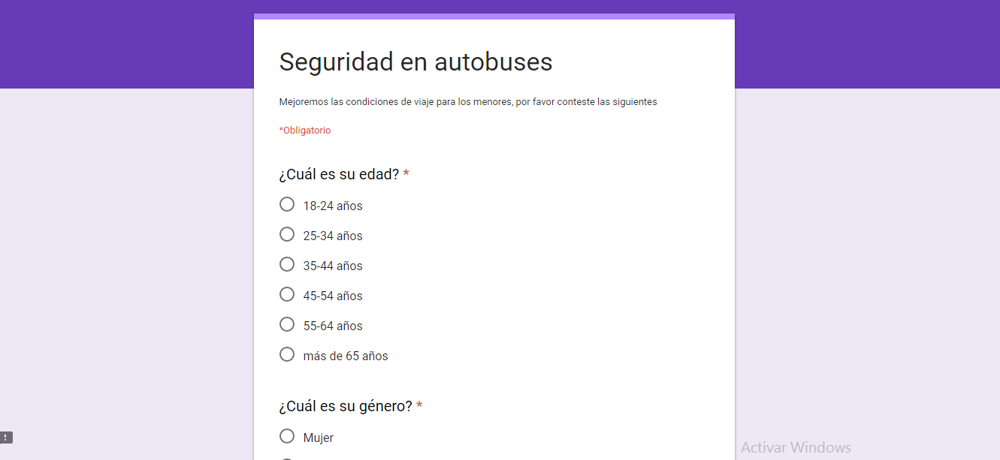
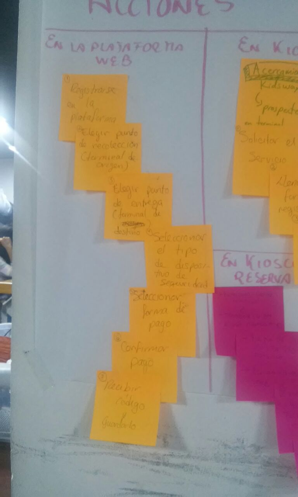
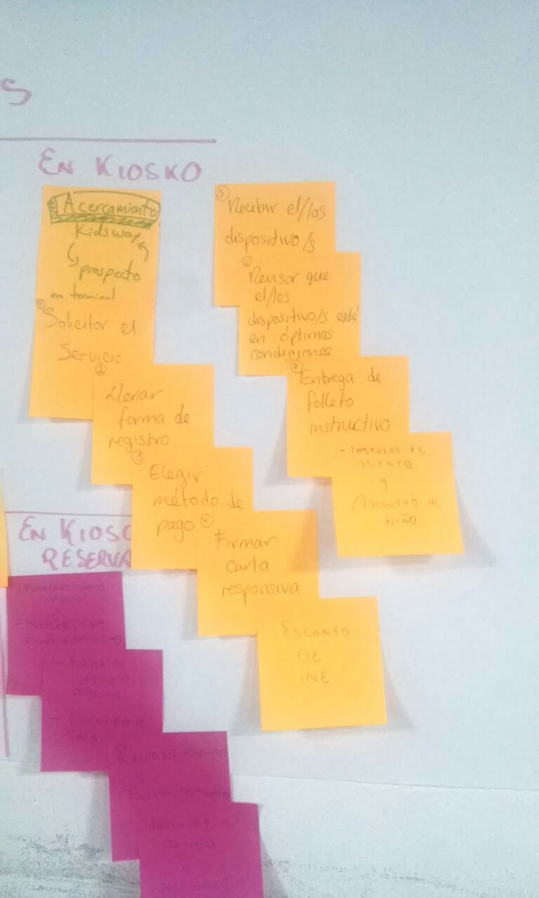
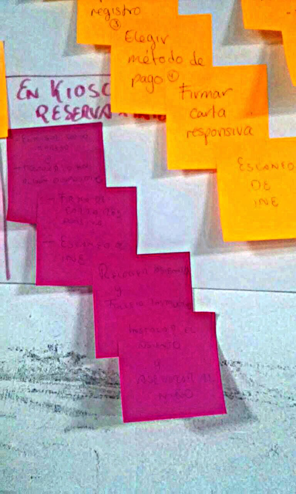
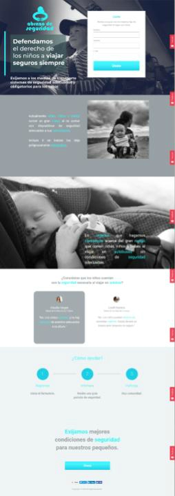
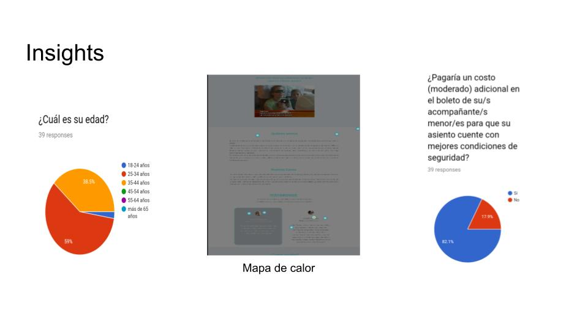
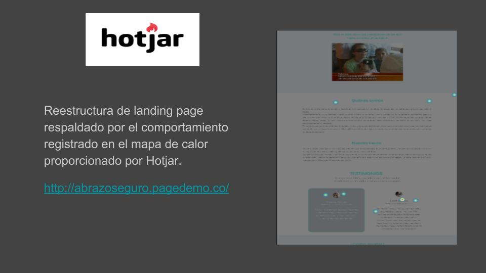
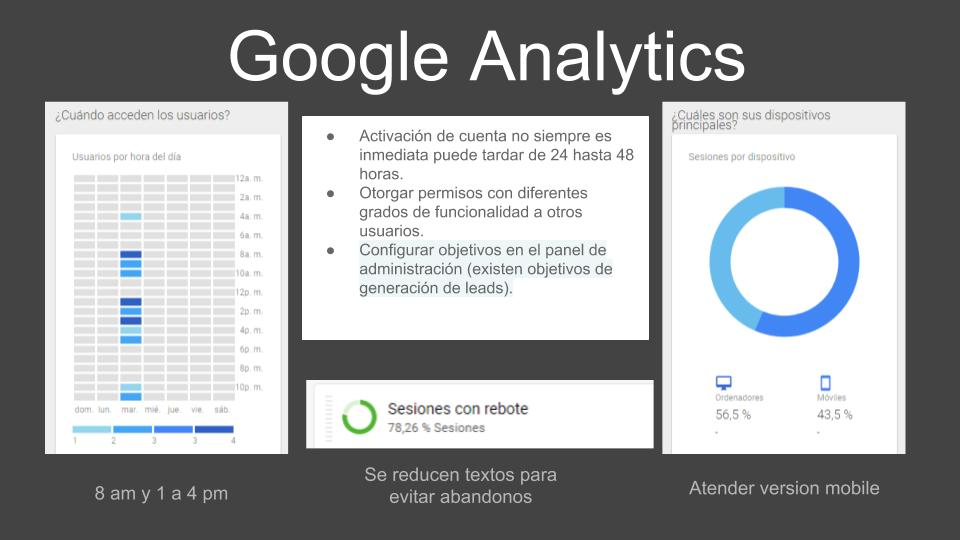

# KIDSWAY
Kidsway es un movimiento con perspectiva de negocio. Se divide en dos partes la primera es una plataforma de renta de asientos de seguridad para niños especialmente diseñados para ser instalados en los autobuses.

Kidsway va de la mano con Abrazo de seguridad que es una Landing-page que promueve un movimiento para defender el derecho de los niños a viajar seguros siempre.

### Empresa para la que fue creado el proyecto: Pullman de Morelos

## PROCESO DE DISEÑO

### Mapa de empatía

En conjunto creamos un mapa de empatía para generar nuestras primeras hipotésis sobre el journey del usuario

.

### Encuesta (Research Cuantitativo)

El Squad realizó una lluvia de ideas para  encontrar los dolores comunes de los pasajeros al viajar de México a Cuernavaca. Dos de las integrantes son mamás y coincidian en la falta de elementos de seguridad especiales para niños. Basandonos en esta suposición realizamos un cuestionario:

### Insigths

De los resultados de este cuestionario encontramos los siguientes *insigths*:

* La mayoría de los encuestados consideran que las medidas de seguridad para niños en los autobuses son insuficientes.
* La mayor parte de los encuestados estarían dispuestos a pagar un costo extra para obtener medidas de seguridad adecuadas para sus hijos.
* Muchos usuarios viajan con dos o más niños pequeños.

### Acciones del usuario (Research Cualitativo)

Elaboramos una lista de los pasos a seguir por el usuario en la tarea de reservar nuestro servicio por medio de:

* ##### La página web

* ##### Kiosco en la terminal de autobuses

* ##### Reserva en página web y entrega en Kiosco

### Landing Page

Para introducirnos en la mente de nuestros usuarios montamos una landing page titulada *"Abrazo de seguridad"* Donde promovemos una invitacion a unirse a nuestro movimiento en favor del derecho de los niños a viajar seguros.

El objetivo es hacer conscientes a los usuarios de la urgencia de cubrir esta necesidad en los viajes en autobús para posteriormente ofrecerles una solución (renta de asientos de seguridad) a través de Kidsway.

Sobre esta landing implementamos herramientas como *Hotjar* y *Google Analitycs* que nos permitieron conocer el desempeño de la página y el nivel de conversiones logradas.

##### Mapas de calor

Gracias a esta herramienta de Hotjar, los mapas de calor nos permitieron saber que elementos eran mas atractivos para nuestros usuarios y cuales no estaban funcionando como nosotros esperabamos.

Gracias a los resultados brindados por estas herramientas tomamos decisiones importantes para reestructurar el flujo de la información, la extensión de los copys, la ubicación de botones, el uso de marcos, el contraste en los colores.

### Integrantes

**Dení Morales**

**Karina Mosqueda**

**Ruby Scarlett Eligio**
